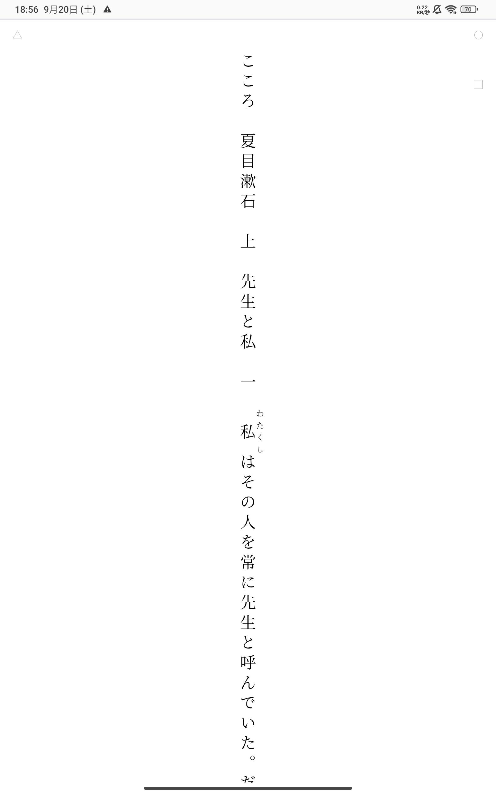
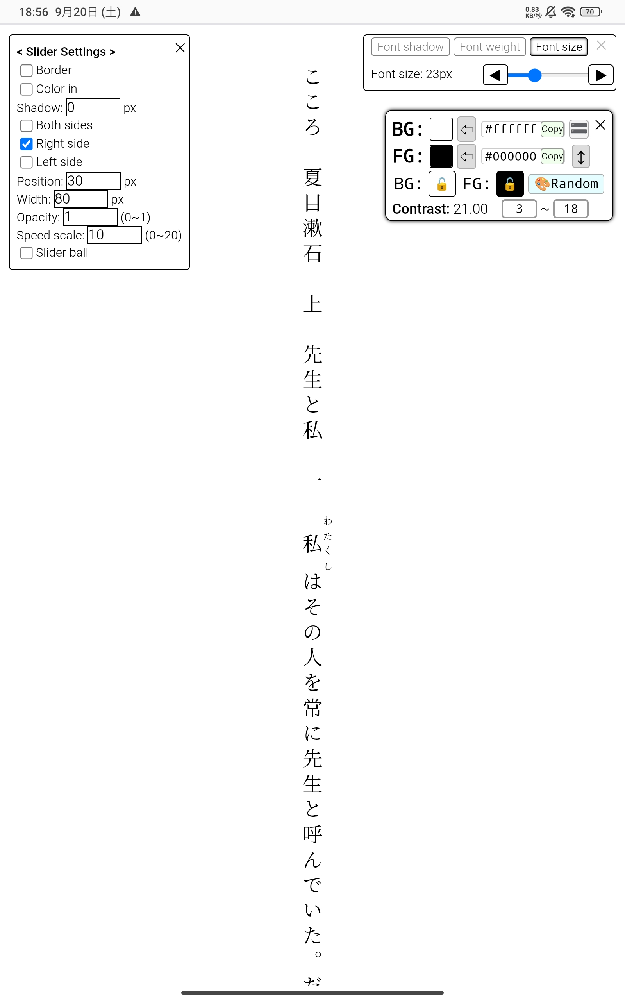
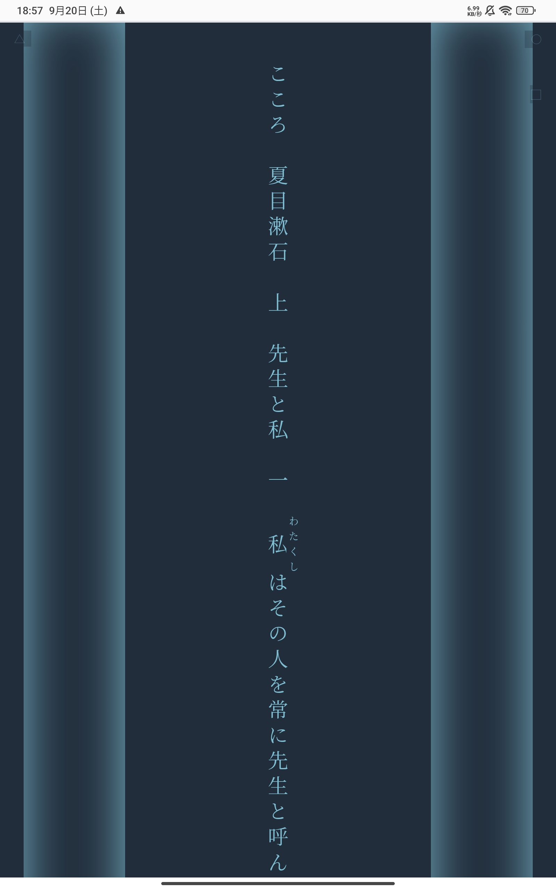

# WEB小説一行化ブックマークレット

## vertical-text-size-color.js
### はじめに
- AIを駆使して作りました。 
AIが書いたコードをコピペ、ツギハギして作ったので、私はプログラミング素人とも名乗れない、プログラミング未経験者です。  
- みもねる氏の｢[青空一行文庫ブックマークレット](https://qiita.com/mimonelu/items/26288a6347e958f500af)｣を知り、使ってみて、｢更にこれが出来たらすごいんじゃないか？｣と思う機能を付け加えていきました。  
- （追記:2025.11/07）AndroidとWindowsでは正常な動作を確認していますが、iOSでは自動スクロールとページ切り替えに不具合があり、快適な利用は無理そうでした。  

### 対象サイト
対象サイトは青空文庫に加え、｢小説家になろう・カクヨム・アルファポリス」です。
  
### 実行
これをコピーして、ブラウザのブックマークのurl欄に貼り付けます。
<pre><code>javascript:(function(){var s=document.createElement('script');s.src='https://cdn.jsdelivr.net/gh/kuansy373/novel-viewer-bookmarklet@v1.4.2/vertical-text-size-color.js';document.body.appendChild(s);})();
</code></pre>
 
最初実行したときは、このような感じです。
  

 
右上、左上にうっすらとある〇や□、△をタップするといろいろ設定できます。
  

 
設定するとこんな感じにできます。左右に伸びてるのはスクロールバーの当たり判定です。
  

### 強み
自動スクロールができる。色を自由に変えられる。長文に対応してる。
### 弱み
- iOSでは自動スクロールとページ切り替えが正常に使えない。 
- カクつきが発生する。(Chromeを使う、リフレッシュレートを60fpsにする、常時スクロールバーに触れる、などで改善することがあります) 
- フォントサイズを変更するとスクロール位置が変わる(ページ内検索をしおり替わりにするとよい)。  

### 注意点
- コードが長く、モバイル端末ではブックマークのURL欄にソースコードが入りきらないため、jsDelivr（CDN）での読み込みになっています。タグでバージョン管理しているため、最新リリースにするには使用者が能動的にタグを最新のものに書き換える必要があります。 ※タグと実際のコードの結びつきを正確に確認したい場合は、「Releases」から該当タグが指しているコミットハッシュを参照ください。  
- ここに載せているjavascript:は常に最新のタグにしています。  
- v1.3.1を含むそれ以前のバージョンは、ブックマークレットを実行した際に新しいタブを開かず、元のページを作り変える仕様のため、広告が読み込まれる前に実行してしまうとまれに宛先不明のメッセージがコンソールに大量に溜まることがあります。v1.4.1以降はDOMの完成後に処理が走るため、webページの読み込み完了を待たなくて大丈夫です。  
- このリポジトリの名前は最初「bookmarklet-release」でしたが、「novel-viewer-bookmarklet」に変更しました。（2025.12）  

### 不具合・要望
不具合、要望がありましたら、このリポジトリ内で報告するか、この [YouTubeの動画](https://youtu.be/b3lUvSqFgrY?si=7jlP4xZH5-1cneE3) のコメント欄に書き込んでください。可能な範囲で修正し、リリースしてここのタグを更新します。
